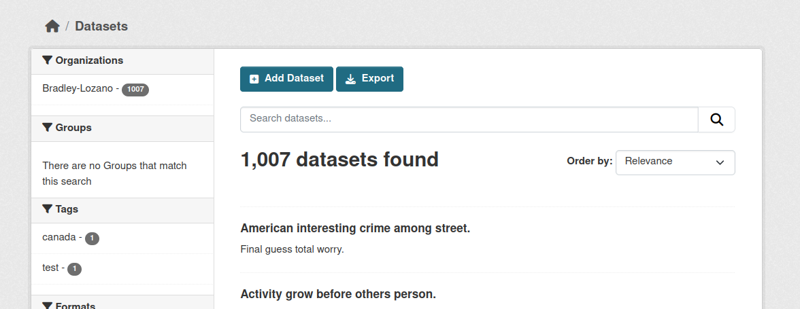
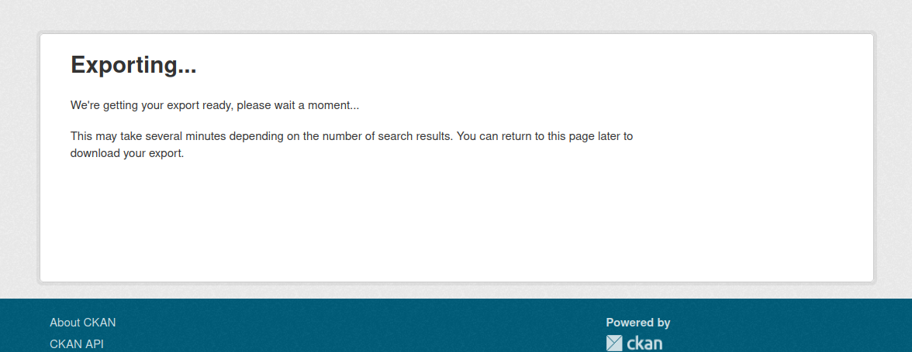
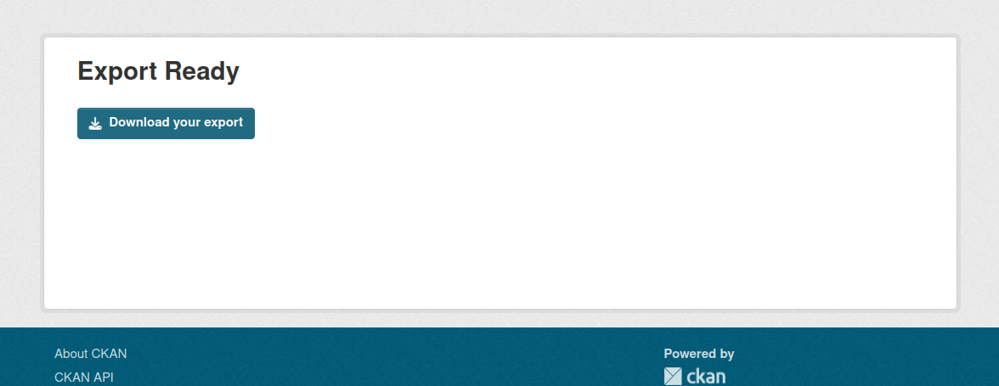

# ckanxt-search-export

Adds an export button to search results, allowing logged-in users to download 
the results without futzing with the API.

Uses CKAN's built-in IUploader and background workers to handle even extremely
large portals with millions of datasets.






## Installation

Install the extension using pip:

```bash
pip install ckanxt-search-export
```

Then add `ckanext-search-export` to the `ckan.plugins` setting in your `ckan.ini` file:

```ini
ckan.plugins = ... ckanext-search-export
```

Ensure that file storage is already enabled in your `ckan.ini`:

```ini
ckan.storage_path = /path/to/your/storage
```

Add the following to your `ckan.ini`:

```ini
ckan.upload.search_export.types = text
ckan.upload.search_export.mimetypes = text/csv
```

## Configuration

Exports are limited to 2MB in size by default, which comes from CKAN's default.
Increase it by adding the following to your `ckan.ini`:

```ini
# The maximum size of the export in MB
search_export.maximum_size = 4
```
